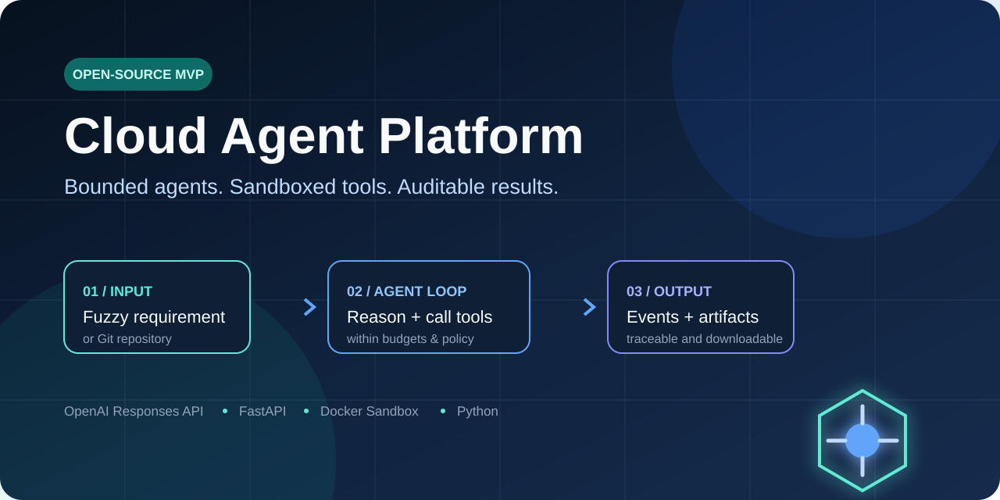
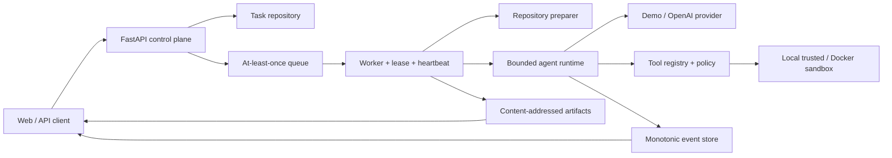

# Cloud Agent Platform

**English** | [简体中文](README.zh-CN.md)



[](https://github.com/aopays/cloud-agent-platform/actions/workflows/ci.yml)
[](https://github.com/aopays/cloud-agent-platform/actions/workflows/security.yml)
[](https://www.python.org/)
[](https://developers.openai.com/api/docs/quickstart)
[](LICENSE)
[](https://github.com/aopays/cloud-agent-platform/stargazers)

An open-source **FDE discovery workspace and Cloud Agent runtime**. It helps Forward Deployed Engineers turn messy customer conversations into evidence-backed, executable technical plans, then run well-scoped repository tasks through bounded, observable AI workflows.

The discovery workflow is designed to stop unproductive meetings: it follows vague words to numbers and examples, separates facts from assumptions, identifies decision makers and system owners, and keeps asking about blockers until the result can be reviewed by architecture, engineering, QA, security, and the customer.

> This repository is a production-aware local MVP and architecture reference, not a hosted production service. The single-agent runtime is implemented today; durable infrastructure, stronger isolation, and multi-agent DAG orchestration are documented evolution paths.

## Why developers use this project

- **Learn the engineering behind coding agents** — not just prompting, but queues, leases, cancellation, budgets, idempotency, events, artifacts, and failure semantics.
- **Run disciplined FDE discovery** — capture customer evidence, As-Is pain, scope, owners, data, integrations, acceptance thresholds, risks, and Go/No-Go conditions.
- **Prototype with a real OpenAI tool loop** — the provider uses the Responses API and structured function calls behind a replaceable interface.
- **Start without an API key** — a deterministic demo provider exercises the full task lifecycle offline.
- **Inspect the security boundary** — command execution is routed through sandbox interfaces with path, timeout, output, process-tree, and network controls.
- **Use it as an interview or architecture reference** — the repository includes requirements, contracts, diagrams, test strategy, security review, release runbook, and an end-to-end SDLC.

If that is useful to you, consider giving the project a ⭐ so other agent engineers can find it.

## What it can do

### 1. Customer conversation → FDE technical discovery package

Start with a short idea such as:

```text
We want to use AI to improve logistics driver scheduling.
```

The FDE workbench follows five stages: business outcome and decision authority, As-Is evidence, scope/rules/exceptions, data/integration/security, and PoC/MVP acceptance. Three rounds unlock a draft; unresolved implementation blockers trigger further questions, up to twelve user rounds. The result is a downloadable technical plan with evidence, open decisions, architecture, acceptance thresholds, delivery gates, and an engineering handoff checklist.

Read the [FDE customer discovery playbook](docs/fde-discovery-playbook.md).

### 2. Natural-language task + Git repository → agent artifact

Submit an instruction and a public Git repository. A worker prepares the repository, starts a bounded agent loop, validates tool calls, executes them through a sandbox adapter, records public events, and returns the final result and downloadable artifacts.

The API exposes:

- task state from `CREATED` to a terminal outcome;
- monotonic status, model, tool, budget, and artifact events;
- agent turns, token usage, and wall-clock usage;
- explicit cancellation, timeout, policy, and execution errors;
- Markdown or text artifacts with download endpoints.

## Run it in 60 seconds — no API key

### Windows PowerShell

```powershell
git clone https://github.com/aopays/cloud-agent-platform.git
cd cloud-agent-platform
python -m venv .venv
.\.venv\Scripts\python.exe -m pip install -c requirements.lock -e ".[dev]"
Copy-Item .env.example .env
$env:LLM_PROVIDER = "demo"
$env:SANDBOX_BACKEND = "local"
.\scripts\start.ps1
```

### Linux and macOS

```bash
git clone https://github.com/aopays/cloud-agent-platform.git
cd cloud-agent-platform
python3 -m venv .venv
./.venv/bin/python -m pip install -c requirements.lock -e ".[dev]"
cp .env.example .env
LLM_PROVIDER=demo SANDBOX_BACKEND=local bash scripts/start.sh
```

Open these pages after startup:

- **Product home:** <http://127.0.0.1:8001/>
- **Requirement discovery:** <http://127.0.0.1:8001/discovery>
- **Interactive API docs:** <http://127.0.0.1:8001/docs>
- **Readiness check:** <http://127.0.0.1:8001/readyz>

You can also run the deterministic lifecycle demo directly:

```powershell
.\.venv\Scripts\python.exe scripts\demo.py
```

It scans `examples/demo-repo` for TODO/FIXME markers and produces a report without contacting a model provider.

## Connect OpenAI

Keep the API key only in your local `.env`; never commit it:

```dotenv
LLM_PROVIDER=openai
OPENAI_API_KEY=<your-api-key>
OPENAI_MODEL=gpt-5.4-mini
SANDBOX_BACKEND=local
```

Then start the application with `.\scripts\start.ps1` on Windows or `bash scripts/start.sh` on Linux/macOS. The provider adapter converts registered tools into Responses API function tools and returns observations with `function_call_output`.

`/readyz` reports the selected provider, model, sandbox, and directory health but never returns the API key.

## Submit a repository task

In Swagger, open `POST /v1/tasks`, select **Authorize**, and enter the development token `local-demo-token`. Add an `Idempotency-Key` of at least eight characters and submit:

```json
{
  "instruction": "Read this repository, find every TODO and FIXME, and create a Markdown report.",
  "repository": {
    "url": "https://github.com/example/project.git",
    "ref": "main"
  }
}
```

Use the returned task ID with:

```text
GET /v1/tasks/{taskId}
GET /v1/tasks/{taskId}/events
GET /v1/tasks/{taskId}/artifacts
GET /v1/tasks/{taskId}/artifacts/{artifactId}
```

Only public HTTPS repositories are supported in the current version. Local `file://` repositories must be under `REPOSITORY_IMPORT_ROOT`. Do not place repository credentials in a URL.

## Architecture



The control plane never executes user commands. The worker owns repository preparation, leases, sandbox lifecycle, runtime invocation, artifact collection, cleanup, and terminal task state. The runtime can call commands only through a validated tool and `SandboxSession` boundary.

Explore the implementation in the [system architecture](docs/system-architecture.md), [code tour](docs/code-tour.md), and [API contract](docs/contracts/openapi.yaml).

## Engineering highlights

- **API and contracts:** FastAPI, Pydantic v2, OpenAPI 3.1, SSE.
- **Agent runtime:** asynchronous bounded loop, provider adapter, function calling, cancellation, retry, no-progress detection.
- **Scheduling:** task state machine, at-least-once delivery, idempotency, leases, heartbeat, cancellation propagation.
- **Tools:** JSON Schema validation, policy hooks, timeouts, output limits, redaction, result submission.
- **Sandboxing:** trusted local adapter plus Docker adapter, non-root execution, dropped capabilities, default-deny network, process-tree cleanup.
- **Quality:** Ruff, strict mypy, pytest, Windows/Linux CI, Docker smoke tests, CodeQL, dependency audit.

## Repository map

```text
src/
├── main.py                 # FastAPI composition root and HTTP endpoints
├── platform.py             # Provider, queue, sandbox and worker wiring
├── worker.py               # End-to-end execution orchestration
├── discovery.py            # Multi-turn requirement discovery and reports
├── agent_runtime/          # Model-tool loop, budgets, events, providers
├── api/                    # Task and discovery routes and schemas
├── scheduler/              # State, queue, leases, cancellation, idempotency
├── sandbox/                # Path, process, resource and Docker policies
├── tools/                  # Tool registry, schemas and built-in tools
├── models/                 # Task and attempt domain models
└── shared/                 # Shared contracts, interfaces and settings
```

## Security boundary

- `SANDBOX_BACKEND=local` is for trusted development inputs only and is rejected outside development/test environments.
- Docker is an MVP isolation layer, not a final boundary for arbitrary hostile code. Production deployments should evaluate gVisor, Kata Containers, or Firecracker.
- The sandbox is denied network access by default and is never given the host Docker socket or platform credentials.
- Paths, tool arguments, command duration, output volume, cancellation, and secret redaction are enforced and tested.
- Production use requires real identity, tenant isolation, persistence, rate limits, audit, and managed secrets.

Read the full [threat model](docs/security-boundary.md) and [security policy](SECURITY.md). Vulnerabilities can be reported privately through GitHub Security Advisories.

## What is implemented vs. next

Implemented today:

- task creation, query, cancellation, event and artifact APIs;
- multi-turn requirement discovery and report download;
- demo and OpenAI providers with a bounded agent/tool loop;
- local trusted and Docker sandbox adapters;
- timeout, cancellation, path escape, output and secret controls;
- unit, integration, end-to-end and security tests.

Planned evolution:

- PostgreSQL, Redis and S3/MinIO adapters;
- authentication, tenancy, RBAC, quotas, rate limits and cost controls;
- temporary least-privilege credentials for private Git repositories;
- richer web console, live task list and persistent SSE subscriptions;
- requirement, architecture, security and QA multi-agent DAGs;
- Temporal/Kubernetes workers and stronger isolation.

See the detailed [multi-agent target architecture](docs/multi-agent-platform-architecture.md) and [full SDLC documentation](docs/sdlc/README.md).

## Contributing

Useful contributions include reproducible agent tasks, eval cases, sandbox attacks, persistence adapters, UI improvements, and documentation fixes.

1. Read [CONTRIBUTING.md](CONTRIBUTING.md).
2. Start with a focused issue or [GitHub Discussion](https://github.com/aopays/cloud-agent-platform/discussions).
3. Keep the trust boundary and public contracts intact.
4. Add tests for every behavior change.

This project is released under the [MIT License](LICENSE). If it helps you build or explain safer agent systems, please ⭐ the repository and share the use case you want it to support next.
