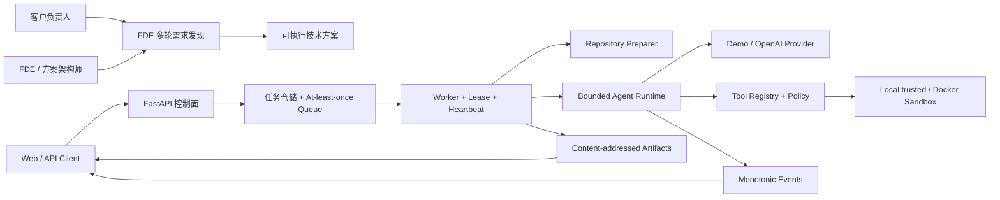

# Cloud Agent Platform

一个从场景面试题做起的 FDE 需求发现与 Agent 执行平台

**简体中文** · [English overview](#english-overview)


[](https://github.com/aopays/cloud-agent-platform/actions/workflows/ci.yml)
[](https://github.com/aopays/cloud-agent-platform/actions/workflows/security.yml)
[](https://www.python.org/)
[](https://developers.openai.com/api/docs/quickstart)
[](LICENSE)
[](https://github.com/aopays/cloud-agent-platform/stargazers)

这个项目最初来自一道 AI 应用开发岗位的场景题：用户提交一句自然语言任务和一个代码仓库，平台在隔离环境中启动 Agent，让模型调用工具完成任务。我在拆题时发现，真正麻烦的地方不只在 Agent Loop。任务开始以前，FDE（Forward Deployed Engineer）往往还要先把客户十几个字的想法问清楚；任务开始以后，平台则要处理排队、超时、取消、权限和失败恢复。

所以仓库里有两个相互关联的功能：

- `/discovery` 用于前期需求访谈。它会继续追问业务目标、现状、规则、数据和验收方式，最后整理成技术方案草稿。
- `/v1/tasks` 用于执行仓库任务。Worker 准备代码，Agent 调用受控工具，平台记录过程并保存结果。

当前版本是本地可运行的 MVP，适合用于面试展示、学习 Agent 工程或继续二次开发。它还不是托管服务：数据主要保存在进程内，产品运行时只有一个 Agent，多 Agent DAG 和生产级基础设施都还在设计阶段。

**文档导航**： [运行项目](#本地运行) · [需求发现](#需求发现会产出什么) · [仓库任务](#仓库任务会返回什么) · [演示建议](#面试时怎么演示) · [架构](#系统结构) · [源码入口](#从哪里开始读代码) · [已知限制](#当前限制)

## 需求发现会产出什么

例如客户只说：

```text
给物流公司设计一个司机排班软件，主要给货车司机使用。
```

系统不会立刻补出一份“完整 PRD”，因为这时大部分信息都没有依据。它会继续问：

- 要改善的业务指标、基线和决策人；
- 当前流程、异常证据、范围与非目标；
- 排班硬约束、软约束和人工兜底规则；
- 司机、车辆、订单、地图等数据与系统负责人；
- 权限、安全、合规、PoC/MVP 验收阈值。

对话达到最低轮次后可以下载 `fde-technical-solution.md`。报告会把客户已经确认的事实、系统暂时采用的假设和仍待决定的问题分开，并整理范围、功能需求、数据接口、架构、安全要求、验收条件和研发移交事项。

## 仓库任务会返回什么

输入自然语言任务和公开 Git URL：

```json
{
  "instruction": "读取仓库，找出所有 TODO 和 FIXME，生成 Markdown 报告。",
  "repository": {
    "url": "https://github.com/example/project.git",
    "ref": "main"
  }
}
```

请求成功后会得到 Task ID。通过查询接口可以看到任务状态、执行事件、工具调用摘要、token/时间用量和最终产物。超时、取消、策略拒绝与普通执行失败使用不同的状态和错误码，方便调用方决定是否重试。

## 本地运行

第一次运行建议先使用 Demo Provider，不需要 OpenAI Key，也不会产生模型费用。

### Windows PowerShell

```powershell
git clone https://github.com/aopays/cloud-agent-platform.git
cd cloud-agent-platform
python -m venv .venv
.\.venv\Scripts\python.exe -m pip install -c requirements.lock -e ".[dev]"
Copy-Item .env.example .env
$env:LLM_PROVIDER = "demo"
$env:SANDBOX_BACKEND = "local"
.\scripts\start.ps1
```

### Linux / macOS

```bash
git clone https://github.com/aopays/cloud-agent-platform.git
cd cloud-agent-platform
python3 -m venv .venv
./.venv/bin/python -m pip install -c requirements.lock -e ".[dev]"
cp .env.example .env
LLM_PROVIDER=demo SANDBOX_BACKEND=local bash scripts/start.sh
```

启动后打开：

- **FDE 需求发现工作台**：<http://127.0.0.1:8001/discovery>
- **API 交互文档**：<http://127.0.0.1:8001/docs>
- **运行就绪检查**：<http://127.0.0.1:8001/readyz>
- **产品首页**：<http://127.0.0.1:8001/>

也可以不启动 Web 服务，直接验证任务生命周期：

```powershell
.\.venv\Scripts\python.exe scripts\demo.py
```

这个 Demo 会扫描 `examples/demo-repo` 中的 TODO/FIXME。报告内容很简单，它的作用是提供一个稳定的端到端样例，用来检查队列、Worker、Runtime、事件和产物是否连通。

## 面试时怎么演示

我通常按下面的顺序演示：

1. 在 `/discovery` 输入“给物流公司设计司机排班软件”。
2. 分三轮补充现在怎么排班、哪些规则不能违反、数据来自哪里，以及 PoC 怎样验收。
3. 下载方案，重点看哪些内容是事实，哪些仍是假设。
4. 打开 `/docs` 提交仓库扫描任务，查看事件和最终文件。
5. 结合架构图解释为什么 API 不直接执行命令，以及取消如何传到正在运行的工具。
6. 最后主动说明内存存储、单 Agent 和 Docker 隔离等限制。

完整讲稿、常见追问、简历描述与诚实边界见 [FDE / AI Agent 面试展示包](docs/fde-interview-kit.md)。

## 系统结构



这里刻意把控制面和执行面分开。FastAPI 负责接收和查询任务，不直接执行用户命令；Worker 负责准备仓库、维护租约、启动沙箱和提交结果。Runtime 也不能直接调用宿主机 shell，只能使用注册过的工具，再由工具访问 `SandboxSession`。

## 从哪里开始读代码

- [`src/discovery.py`](src/discovery.py)：FDE 访谈状态、就绪门禁、Provider Prompt 和技术方案生成。
- [`src/agent_runtime/loop.py`](src/agent_runtime/loop.py)：有界模型—工具循环，处理预算、取消、重试、重复调用和无进展终止。
- [`src/agent_runtime/openai_provider.py`](src/agent_runtime/openai_provider.py)：OpenAI Responses API 适配器，把注册工具映射为 function tools。
- [`src/tools/`](src/tools/)：工具注册、JSON Schema 校验、策略 Hook、超时、输出限额、脱敏与结果提交。
- [`src/scheduler/`](src/scheduler/)：任务状态机、幂等、队列投递、执行租约、心跳和取消传播。
- [`src/worker.py`](src/worker.py)：从领取任务到终态提交的纵向编排。
- [`src/sandbox/`](src/sandbox/)：本地可信与 Docker Session、路径和符号链接防护、进程树与资源策略。
- [`src/storage.py`](src/storage.py)：原子事件序列和内容寻址产物的 MVP 存储实现。

如果是第一次阅读，建议按 `src/main.py` → `src/platform.py` → `src/worker.py` → `src/agent_runtime/loop.py` 的顺序走一遍主流程。更细的说明放在 [代码导览](docs/code-tour.md) 和 [系统架构](docs/system-architecture.md) 中。

## 实现时重点处理的问题

- Agent 不能一直跑。模型轮次、输入 token、总时间、命令时间和工具输出都有上限。
- 取消不是只改数据库状态。请求会传到 Runtime、工具协程，并触发进程树清理。
- 队列按 at-least-once 设计，因此任务创建和终态提交必须考虑幂等与重复投递。
- 日志不保存模型的私有思维链，只记录任务状态、行动摘要、工具、预算和错误。
- Provider、队列、事件、产物与 Sandbox 使用接口隔开，后续可以替换实现。
- Local Sandbox 只用于可信输入；Docker 配置了禁网、非 root、capabilities 和资源限制，但仍不是最终的强隔离方案。

## 接入 OpenAI

只在本机 `.env` 中填写 Key，永远不要提交到 Git：

```dotenv
LLM_PROVIDER=openai
OPENAI_API_KEY=<your-api-key>
OPENAI_MODEL=gpt-5.4-mini
SANDBOX_BACKEND=local
```

然后执行 `.\scripts\start.ps1`，Linux/macOS 执行 `bash scripts/start.sh`。`/readyz` 会显示 Provider、模型、Sandbox 和目录健康状态，但不会返回 API Key。

在 Swagger 的 `POST /v1/tasks` 中点击 **Authorize**，开发环境 Token 输入 `local-demo-token`；请求头 `Idempotency-Key` 至少 8 个字符。使用返回的 Task ID 查询：

```text
GET /v1/tasks/{taskId}
GET /v1/tasks/{taskId}/events
GET /v1/tasks/{taskId}/artifacts
GET /v1/tasks/{taskId}/artifacts/{artifactId}
```

当前只支持公开 HTTPS 仓库。`file://` 仓库必须位于 `REPOSITORY_IMPORT_ROOT` 下；不要把仓库凭证写进 URL。

## 相关文档

- [FDE / AI Agent 面试展示包](docs/fde-interview-kit.md)：3 分钟讲稿、Demo、常见追问、STAR 和简历写法。
- [FDE 客户需求发现手册](docs/fde-discovery-playbook.md)：访谈阶段、证据模型、就绪门禁和研发移交。
- [产品定位与需求](docs/product-positioning.md)：目标用户、业务痛点、MVP 范围和成功指标。
- [系统架构](docs/system-architecture.md)：上下文、容器、组件、时序、信任边界和演进架构图。
- [完整软件开发生命周期](docs/sdlc/README.md)：PRD、SRS、数据/API、开发、测试、安全、发布和 SRE。
- [多 Agent 目标架构](docs/multi-agent-platform-architecture.md)：需求、架构、安全与 QA Agent 的 DAG 设计。
- [安全边界](docs/security-boundary.md) 与 [安全策略](SECURITY.md)：威胁模型、已实现控制和生产缺口。
- [对标仓库增长分析](docs/open-source-growth-analysis.md)：哪些传播方法值得学习，哪些夸大方式不应该复制。

## 当前做到哪里

现在已经可以跑通：

- FDE 多轮需求发现、就绪判断、技术方案生成和下载；
- 任务创建、查询、取消、事件与产物 API；
- Demo/OpenAI Provider、有界 Agent Loop、工具注册与预算；
- 本地可信和 Docker Sandbox Adapter；
- 路径逃逸、超时、取消、输出限额和秘密脱敏；
- 单元、集成、端到端、安全测试与跨平台 CI。

下面这些还没有实现，是后续可能继续做的内容：

- PostgreSQL、Redis、S3/MinIO 持久化 Adapter；
- OIDC、租户、RBAC、配额、限流、成本中心和审计；
- 私有 Git 仓库的短期最小权限凭证；
- 任务列表、持续 SSE 和完整 Web Console；
- 需求、架构、安全、QA 多 Agent DAG 与独立质量门；
- Temporal/Kubernetes Worker 与 gVisor、Kata 或 Firecracker 强隔离。

## 当前限制

任务、队列和事件目前主要保存在进程内，服务重启后不能恢复。`SANDBOX_BACKEND=local` 只适合自己控制的代码，并且在非 development/test 环境会被拒绝。Docker Adapter 增加了一层隔离，但不能据此运行任意恶意代码。若要用于生产环境，至少还需要补充真实身份、多租户隔离、持久化、限流、托管密钥和更强的沙箱。

详细威胁模型见 [docs/security-boundary.md](docs/security-boundary.md)。安全问题请通过 GitHub Security Advisories 私下报告。

## 我用这些命令检查项目

```powershell
.\.venv\Scripts\python.exe -m ruff format --check .
.\.venv\Scripts\python.exe -m ruff check .
.\.venv\Scripts\python.exe -m mypy src
.\.venv\Scripts\python.exe -m pytest -q
.\.venv\Scripts\python.exe -m pytest -m security -q
.\.venv\Scripts\python.exe -m compileall -q src tests scripts
```

## 参与项目

如果你发现了可以复现的 Agent 失败、沙箱绕过方式，或者愿意补持久化 Adapter 和 Web 页面，可以先开 Issue 说明场景。提交代码前请阅读 [CONTRIBUTING.md](CONTRIBUTING.md)。项目使用 [MIT License](LICENSE)。

如果这个项目对你有用，可以点一个 Star 方便以后找到。也欢迎在 [Issues](https://github.com/aopays/cloud-agent-platform/issues) 留下真实需求；比起“再加一个 Agent”，我更希望后续功能来自可以复现的问题。

## English overview

Cloud Agent Platform started as an AI application engineering interview project. It combines an FDE requirement-discovery workflow with a small, bounded runtime for repository tasks.

The current version runs locally and includes multi-turn discovery, task/event/artifact APIs, Demo and OpenAI providers, validated tools, cancellation, budgets, and local/Docker sandbox adapters. State is mostly in memory and the product runtime is still single-agent; the multi-agent DAG in the documentation is a future design.

Start with the [local setup](#本地运行), read the [system architecture](docs/system-architecture.md), or use the [interview notes](docs/fde-interview-kit.md).
