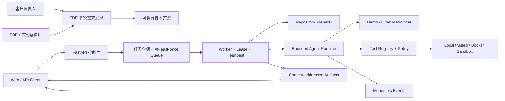

# 🧭 Cloud Agent Platform

**面向 FDE 的客户需求发现工作台 + 可审计的 Cloud Agent 运行平台**

**简体中文** · [English overview](#english-overview)


[](https://github.com/aopays/cloud-agent-platform/actions/workflows/ci.yml)
[](https://github.com/aopays/cloud-agent-platform/actions/workflows/security.yml)
[](https://www.python.org/)
[](https://developers.openai.com/api/docs/quickstart)
[](LICENSE)
[](https://github.com/aopays/cloud-agent-platform/stargazers)

客户说：“我们想用 AI 优化司机排班。”真正困难的不是马上写代码，而是弄清楚谁负责决策、现在损失多少、规则和例外是什么、数据在哪里，以及怎样才算交付成功。

Cloud Agent Platform 把这类模糊沟通变成两条可运行链路：

1. **模糊需求 → FDE 技术方案**：多轮追问证据、范围、规则、数据、集成、安全和验收，生成可交给架构、研发、QA 与客户评审的 Markdown 方案。
2. **自然语言任务 + Git 仓库 → Agent 产物**：在有预算、可取消、可追踪的工具循环中读取仓库、调用工具、记录事件并返回报告。

> 这是一个 production-aware 的本地 MVP 和系统设计参考，不是已经上线的 SaaS。当前实现的是单 Agent 工具循环；多 Agent DAG、持久化基础设施和更强隔离是明确标注的演进方向。

**快速导航**： [输入与输出](#30-秒看懂输入与输出) · [本地启动](#本地快速跑通不需要-openai-key) · [面试演示](#5-分钟面试演示路线) · [系统架构](#一张图看懂系统) · [关键源码](#关键模块不只是-prompt) · [工程资料](#工程资料包) · [安全边界](#安全说明)

## 先看结论：这个项目适合谁

- **FDE / 解决方案架构师**：减少无效访谈，把客户口头描述变成带证据、责任人与 Go/No-Go 条件的实施输入。
- **AI 应用开发工程师**：学习 Responses API、Function Calling、Agent Loop、工具注册、预算与失败语义如何组成真实系统。
- **Agent Platform / 后端工程师**：研究任务状态机、幂等、at-least-once 投递、租约、取消、事件和产物闭环。
- **准备系统设计面试的开发者**：可以运行、演示、读代码，也能解释安全边界、工程取舍与生产演进路线。

如果你只想找一个聊天页面，这个仓库可能太重；如果你想解释“Agent 为什么能安全、可靠地替人做事”，它正好从最容易被忽略的工程问题开始。

## 30 秒看懂输入与输出

### 场景 A：FDE 需求发现

输入一句不完整的客户需求：

```text
给物流公司设计一个司机排班软件，主要给货车司机使用。
```

系统不会直接编造完整 PRD，而是继续确认：

- 要改善的业务指标、基线和决策人；
- 当前流程、异常证据、范围与非目标；
- 排班硬约束、软约束和人工兜底规则；
- 司机、车辆、订单、地图等数据与系统负责人；
- 权限、安全、合规、PoC/MVP 验收阈值。

最终下载 `fde-technical-solution.md`，包含事实/假设/决策/风险、As-Is/To-Be、FR 编号、数据和接口、架构、安全/NFR、验收门槛、交付阶段及研发移交清单。

### 场景 B：仓库 Agent 任务

输入自然语言任务和公开 Git URL：

```json
{
  "instruction": "读取仓库，找出所有 TODO 和 FIXME，生成 Markdown 报告。",
  "repository": {
    "url": "https://github.com/example/project.git",
    "ref": "main"
  }
}
```

平台返回 Task ID、终态、单调递增事件、工具调用摘要、Agent turns、token/时间用量，以及可下载的 Markdown 或文本产物。超时、取消、策略拒绝和执行失败都有明确错误语义。

## 本地快速跑通：不需要 OpenAI Key

### Windows PowerShell

```powershell
git clone https://github.com/aopays/cloud-agent-platform.git
cd cloud-agent-platform
python -m venv .venv
.\.venv\Scripts\python.exe -m pip install -c requirements.lock -e ".[dev]"
Copy-Item .env.example .env
$env:LLM_PROVIDER = "demo"
$env:SANDBOX_BACKEND = "local"
.\scripts\start.ps1
```

### Linux / macOS

```bash
git clone https://github.com/aopays/cloud-agent-platform.git
cd cloud-agent-platform
python3 -m venv .venv
./.venv/bin/python -m pip install -c requirements.lock -e ".[dev]"
cp .env.example .env
LLM_PROVIDER=demo SANDBOX_BACKEND=local bash scripts/start.sh
```

启动后打开：

- **FDE 需求发现工作台**：<http://127.0.0.1:8001/discovery>
- **API 交互文档**：<http://127.0.0.1:8001/docs>
- **运行就绪检查**：<http://127.0.0.1:8001/readyz>
- **产品首页**：<http://127.0.0.1:8001/>

也可以不启动 Web 服务，直接验证任务生命周期：

```powershell
.\.venv\Scripts\python.exe scripts\demo.py
```

离线 Demo 使用确定性 Provider，不访问模型、不产生模型费用。它会扫描 `examples/demo-repo` 并生成 TODO/FIXME 报告，用于证明队列、Worker、Runtime、事件与产物已经连通。

## 5 分钟面试演示路线

1. 在 `/discovery` 输入“给物流公司设计司机排班软件”。
2. 用三轮回答补充现状损失、强制规则、数据源和验收指标。
3. 下载技术方案，展示系统没有把假设伪装成客户事实。
4. 打开 `/docs`，提交一个仓库扫描任务并查看事件和产物。
5. 用下方架构图解释控制面、执行面、沙箱边界和失败语义。
6. 最后说明当前限制与 PostgreSQL/Redis/S3、多租户、强沙箱和多 Agent DAG 的演进路径。

完整讲稿、常见追问、简历描述与诚实边界见 [FDE / AI Agent 面试展示包](docs/fde-interview-kit.md)。

## 一张图看懂系统



控制面不执行用户命令。Worker 负责仓库准备、租约、沙箱生命周期、Runtime 调用、产物和终态；Runtime 只能通过经过 Schema 与策略校验的工具访问 `SandboxSession`，不能直接在宿主机执行 shell。

## 关键模块：不只是 Prompt

- [`src/discovery.py`](src/discovery.py)：FDE 访谈状态、就绪门禁、Provider Prompt 和技术方案生成。
- [`src/agent_runtime/loop.py`](src/agent_runtime/loop.py)：有界模型—工具循环，处理预算、取消、重试、重复调用和无进展终止。
- [`src/agent_runtime/openai_provider.py`](src/agent_runtime/openai_provider.py)：OpenAI Responses API 适配器，把注册工具映射为 function tools。
- [`src/tools/`](src/tools/)：工具注册、JSON Schema 校验、策略 Hook、超时、输出限额、脱敏与结果提交。
- [`src/scheduler/`](src/scheduler/)：任务状态机、幂等、队列投递、执行租约、心跳和取消传播。
- [`src/worker.py`](src/worker.py)：从领取任务到终态提交的纵向编排。
- [`src/sandbox/`](src/sandbox/)：本地可信与 Docker Session、路径和符号链接防护、进程树与资源策略。
- [`src/storage.py`](src/storage.py)：原子事件序列和内容寻址产物的 MVP 存储实现。

逐文件阅读建议见 [代码导览](docs/code-tour.md)，完整设计见 [系统架构](docs/system-architecture.md)。

## 为什么它比普通 Agent Demo 更值得讨论

- **可控**：模型轮次、输入 token、墙钟时间、命令时间和输出大小都有上限。
- **可取消**：取消从 API 传播到 Worker、Runtime、工具协程和进程树清理。
- **可恢复地设计**：任务状态机、at-least-once 队列、幂等键、租约和心跳都有显式语义。
- **可审计**：只记录公开行动摘要、状态、工具和预算事件，不持久化模型私有思维链。
- **可替换**：Provider、任务仓储、队列、租约、事件、产物和 Sandbox 都通过接口保留替换点。
- **安全边界明确**：默认禁网、非 root、capabilities 最小化、路径穿越防护、输出脱敏和资源限制。
- **工程事实可验证**：Ruff、strict mypy、pytest、Windows/Linux CI、Docker smoke、CodeQL 和依赖审计已经配置。

## 接入 OpenAI

只在本机 `.env` 中填写 Key，永远不要提交到 Git：

```dotenv
LLM_PROVIDER=openai
OPENAI_API_KEY=<your-api-key>
OPENAI_MODEL=gpt-5.4-mini
SANDBOX_BACKEND=local
```

然后执行 `.\scripts\start.ps1`，Linux/macOS 执行 `bash scripts/start.sh`。`/readyz` 会显示 Provider、模型、Sandbox 和目录健康状态，但不会返回 API Key。

在 Swagger 的 `POST /v1/tasks` 中点击 **Authorize**，开发环境 Token 输入 `local-demo-token`；请求头 `Idempotency-Key` 至少 8 个字符。使用返回的 Task ID 查询：

```text
GET /v1/tasks/{taskId}
GET /v1/tasks/{taskId}/events
GET /v1/tasks/{taskId}/artifacts
GET /v1/tasks/{taskId}/artifacts/{artifactId}
```

当前只支持公开 HTTPS 仓库。`file://` 仓库必须位于 `REPOSITORY_IMPORT_ROOT` 下；不要把仓库凭证写进 URL。

## 工程资料包

- [FDE / AI Agent 面试展示包](docs/fde-interview-kit.md)：3 分钟讲稿、Demo、常见追问、STAR 和简历写法。
- [FDE 客户需求发现手册](docs/fde-discovery-playbook.md)：访谈阶段、证据模型、就绪门禁和研发移交。
- [产品定位与需求](docs/product-positioning.md)：目标用户、业务痛点、MVP 范围和成功指标。
- [系统架构](docs/system-architecture.md)：上下文、容器、组件、时序、信任边界和演进架构图。
- [完整软件开发生命周期](docs/sdlc/README.md)：PRD、SRS、数据/API、开发、测试、安全、发布和 SRE。
- [多 Agent 目标架构](docs/multi-agent-platform-architecture.md)：需求、架构、安全与 QA Agent 的 DAG 设计。
- [安全边界](docs/security-boundary.md) 与 [安全策略](SECURITY.md)：威胁模型、已实现控制和生产缺口。
- [对标仓库增长分析](docs/open-source-growth-analysis.md)：哪些传播方法值得学习，哪些夸大方式不应该复制。

## 已实现与演进路线

已实现：

- FDE 多轮需求发现、就绪判断、技术方案生成和下载；
- 任务创建、查询、取消、事件与产物 API；
- Demo/OpenAI Provider、有界 Agent Loop、工具注册与预算；
- 本地可信和 Docker Sandbox Adapter；
- 路径逃逸、超时、取消、输出限额和秘密脱敏；
- 单元、集成、端到端、安全测试与跨平台 CI。

下一阶段：

- PostgreSQL、Redis、S3/MinIO 持久化 Adapter；
- OIDC、租户、RBAC、配额、限流、成本中心和审计；
- 私有 Git 仓库的短期最小权限凭证；
- 任务列表、持续 SSE 和完整 Web Console；
- 需求、架构、安全、QA 多 Agent DAG 与独立质量门；
- Temporal/Kubernetes Worker 与 gVisor、Kata 或 Firecracker 强隔离。

## 安全说明

`SANDBOX_BACKEND=local` 只适合可信开发输入，并且在非 development/test 环境会被拒绝。Docker 是 MVP 隔离层，不是运行任意恶意代码的最终安全边界。生产环境还必须补齐真实身份、多租户隔离、持久化、限流、托管密钥和更强沙箱。

详细威胁模型见 [docs/security-boundary.md](docs/security-boundary.md)。安全问题请通过 GitHub Security Advisories 私下报告。

## 本地质量门

```powershell
.\.venv\Scripts\python.exe -m ruff format --check .
.\.venv\Scripts\python.exe -m ruff check .
.\.venv\Scripts\python.exe -m mypy src
.\.venv\Scripts\python.exe -m pytest -q
.\.venv\Scripts\python.exe -m pytest -m security -q
.\.venv\Scripts\python.exe -m compileall -q src tests scripts
```

## 开源协作

欢迎贡献可复现任务、Eval 数据、安全攻击用例、持久化 Adapter、Web Console 和文档修复。提交前请阅读 [CONTRIBUTING.md](CONTRIBUTING.md)。项目使用 [MIT License](LICENSE)。

如果这个项目帮助你理解 FDE 需求发现、Agent 编排、工具调用或沙箱工程，请给它一个 ⭐。比 Star 更重要的是：欢迎在 [Issues](https://github.com/aopays/cloud-agent-platform/issues) 留下一个真实业务需求或失败案例，让下一次迭代解决真实问题。

## English overview

Cloud Agent Platform is an open-source **FDE customer-discovery workspace and bounded Cloud Agent runtime**. It turns vague customer conversations into evidence-backed technical plans, and runs scoped repository tasks through observable model-tool workflows.

The runnable MVP includes multi-turn discovery, FastAPI task/event/artifact APIs, Demo and OpenAI Responses providers, a bounded agent loop, validated tools, scheduling semantics, local/Docker sandbox adapters, automated tests, CI, and explicit security boundaries. It does **not** claim that the documented multi-agent DAG or production persistence stack is already implemented.

Start with the [local quickstart](#本地快速跑通不需要-openai-key), read the [system architecture](docs/system-architecture.md), or use the [interview and demo kit](docs/fde-interview-kit.md).
