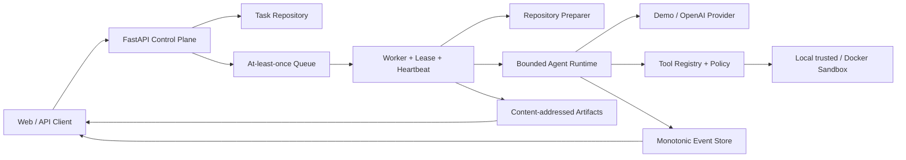

# Cloud Agent Platform

[English](README.md) | **简体中文**

> **Turn fuzzy ideas and code repositories into bounded, auditable AI work.**
> 从客户的一句模糊需求到可执行技术方案，从一个 Git 仓库到可追踪的 Agent 执行结果。


Cloud Agent Platform 是一个面向 **FDE、解决方案架构师、AI 应用工程师和平台工程团队** 的开源 MVP。
它把“LLM 会调用工具”扩展成一条可以真正运行、取消、审计和演进的工程链路：API 接收任务，调度器投递，
Worker 准备仓库，Agent Runtime 循环推理与调用工具，Sandbox 控制执行边界，最终返回事件、用量与产物。

项目的第一入口是 **FDE 客户需求发现工作台**：FDE 可以输入企业负责人的十几个字模糊需求，系统围绕业务结果、
决策人、现状证据、范围与非目标、规则、数据、集成、安全和验收继续追问，直到形成可交给架构、开发、QA、
安全和客户共同评审的技术方案草案。

> 当前版本是可运行的本地开发与架构演示 MVP，不是生产级托管平台。运行时已经实现单 Agent 工具循环；
> 多 Agent DAG、持久化基础设施和强隔离属于清晰定义的演进路线，而非已经上线的能力。

## 为什么值得关注

- **不是一个聊天壳**：包含任务状态机、at-least-once 队列、执行租约、取消传播、预算和产物管理。
- **不是一个无限循环脚本**：模型轮次、token、墙钟时间、命令时间和工具输出都有上限。
- **不是把 Docker 当魔法**：明确 local 与 Docker 沙箱的信任边界，并提供路径穿越、符号链接、进程树和资源限制测试。
- **不是只展示 Happy Path**：失败、超时、取消、重复投递、幂等冲突和清理失败都有显式语义。
- **不是只画目标架构**：仓库同时保留 As-Is 可运行代码、Next 演进设计和完整 SDLC 文档，方便面试讲解和二次开发。

## 两条可运行产品链路

### 1. 客户沟通 → FDE 技术发现与可执行方案

适合 FDE、解决方案架构师、售前技术顾问和交付负责人。输入例如：

```text
我们想用 AI 提升物流司机排班效率
```

系统按业务结果与决策人、As-Is 证据、范围/规则/异常、数据/集成/安全、PoC/MVP 验收五个阶段推进。
三轮后可以生成草案，但关键阻塞项未关闭时仍会继续追问，单会话最多十二轮。最终输出客户证据、事实/假设/决策、
技术架构、验收阈值、Go/No-Go 条件和研发移交清单。入口：`http://127.0.0.1:8001/discovery`。

详细方法见 [FDE 客户需求发现工作手册](docs/fde-discovery-playbook.md)。

### 2. 自然语言任务 + Git 仓库 → Agent 产物

适合研发团队、代码治理平台和 Agent Platform 学习者。输入包括自然语言指令、公开 HTTPS Git URL 或允许目录内
的 `file://` 仓库 URI。平台返回：

- Task ID 与完整状态；
- 单调递增的公开事件流；
- 工具调用摘要、持续时间和截断信息；
- Agent turns、token 与墙钟用量；
- 可下载的 Markdown/文本产物；
- 安全错误码、取消或超时结果。

## 60 秒离线体验

离线 Demo 不需要 OpenAI API Key，也不会产生模型费用：

```powershell
python -m venv .venv
.\.venv\Scripts\python.exe -m pip install -c requirements.lock -e ".[dev]"
Copy-Item .env.example .env
# 将 .env 中的 LLM_PROVIDER 改为 demo，SANDBOX_BACKEND 改为 local
.\scripts\start.ps1
```

启动后打开：

- 首页：<http://127.0.0.1:8001/>
- 需求挖掘：<http://127.0.0.1:8001/discovery>
- Swagger API：<http://127.0.0.1:8001/docs>
- 就绪检查：<http://127.0.0.1:8001/readyz>

也可以直接运行确定性示例：

```powershell
.\.venv\Scripts\python.exe scripts\demo.py
```

该示例扫描 `examples/demo-repo` 中的 TODO/FIXME 并生成报告，用于验证完整任务生命周期。

## 接入 OpenAI

复制配置文件：

```powershell
Copy-Item .env.example .env
```

只在本机 `.env` 中填写密钥，不要提交到 Git：

```dotenv
LLM_PROVIDER=openai
OPENAI_API_KEY=<your-api-key>
OPENAI_MODEL=gpt-5.4-mini
SANDBOX_BACKEND=local
```

然后启动：

```powershell
.\scripts\start.ps1
```

Linux/macOS 使用 `bash scripts/start.sh`。项目通过可替换的 `LLMProvider` 接口调用 OpenAI Responses API，
把本地工具转换成 function tools，并使用 `function_call_output` 继续模型—工具循环。实现与概念可参考
[OpenAI Developer Quickstart](https://developers.openai.com/api/docs/quickstart) 和
[Responses API Reference](https://developers.openai.com/api/reference/resources/responses/methods/create)。

`/readyz` 只报告 Provider、模型、Sandbox 和目录状态，不返回 API Key。

## 提交仓库任务

打开 Swagger 的 `POST /v1/tasks`，点击 **Authorize** 并在开发环境输入 `local-demo-token`。设置至少 8 个字符的
`Idempotency-Key`，请求体示例：

```json
{
  "instruction": "读取仓库，找出所有 TODO 和 FIXME，生成 Markdown 报告。",
  "repository": {
    "url": "https://github.com/example/project.git",
    "ref": "main"
  }
}
```

之后依次调用：

```text
GET /v1/tasks/{taskId}
GET /v1/tasks/{taskId}/events
GET /v1/tasks/{taskId}/artifacts
GET /v1/tasks/{taskId}/artifacts/{artifactId}
```

本地仓库必须位于 `REPOSITORY_IMPORT_ROOT` 下。当前版本只支持公开 HTTPS Git 仓库；私有仓库的任务级临时凭证
注入属于下一阶段能力，请勿把 Token 拼进 URL。

## 架构一览



核心设计是 **控制面与执行面分离**。API 不执行用户命令；Worker 负责租约、仓库、沙箱、Runtime、产物和终态；
Runtime 不直接调用宿主机 shell，而是通过结构化工具与 `SandboxSession` 交互。

完整图解见 [系统架构](docs/system-architecture.md)，逐文件讲解见 [代码导览](docs/code-tour.md)。

## 技术栈

- **API / Schema**：Python 3.10+、FastAPI、Pydantic v2、OpenAPI 3.1、SSE。
- **Agent Runtime**：异步 Python、有界循环、Provider Adapter、结构化 function calling。
- **调度与可靠性**：进程内队列/仓储/租约 MVP，at-least-once、幂等键、心跳与取消传播。
- **工具系统**：JSON Schema 校验、权限策略、超时、输出限额、脱敏和结果提交。
- **沙箱**：可信本地 Adapter、Docker Adapter、非 root、cap-drop、默认禁网和进程树清理。
- **存储**：进程内事件/任务状态、本地内容寻址产物；接口预留 PostgreSQL、Redis、S3 替换点。
- **工程质量**：Ruff、mypy strict、pytest、Windows/Linux CI、Docker smoke 与安全标记测试。

## 代码地图

```text
src/
├── main.py                 # FastAPI composition root、SSE、下载与健康检查
├── platform.py             # Provider、Queue、Sandbox、Worker 的依赖装配
├── worker.py               # 从领取任务到终态提交的执行编排
├── discovery.py            # FDE 多轮客户发现、就绪门禁与技术方案生成
├── agent_runtime/          # 模型—工具循环、预算、事件、OpenAI Adapter
├── api/                    # Task/Discovery 路由与 Pydantic Schema
├── scheduler/              # 状态机、队列、租约、取消和幂等
├── sandbox/                # 路径、进程、资源策略、本地与 Docker Session
├── tools/                  # Tool Registry、Schema 校验和内置工具
├── models/                 # 任务与 Attempt 领域模型
└── shared/                 # 公共契约、接口与配置
```

## 文档中心

- [文档导航](docs/README.md)：按产品、开发、架构、安全、测试和发布查阅。
- [FDE 客户发现手册](docs/fde-discovery-playbook.md)：访谈阶段、证据模型、就绪门禁和研发移交。
- [产品定位与需求](docs/product-positioning.md)：谁会用、解决什么问题、MVP 范围和成功指标。
- [代码导览](docs/code-tour.md)：像代码解释器一样按入口、调用链和模块阅读项目。
- [系统架构](docs/system-architecture.md)：上下文、容器、组件、时序、信任边界和演进架构图。
- [完整软件开发生命周期](docs/sdlc/README.md)：PRD、SRS、数据/API、开发、测试、安全、发布、SRE 与移交。
- [多 Agent 目标架构](docs/multi-agent-platform-architecture.md)：需求、设计与开发团队的 DAG 和角色边界。
- [安全策略](SECURITY.md) 与 [沙箱安全边界](docs/security-boundary.md)。
- [贡献指南](CONTRIBUTING.md) 与 [发布前检查清单](docs/release-checklist.md)。

## 已实现、未实现与演进方向

### 已实现（As-Is）

- 任务创建、查询、取消、事件与产物 API；
- 面向 FDE 的多轮客户发现页面与可执行技术方案下载；
- Worker、可见性超时、租约、心跳、幂等与状态机；
- Demo/OpenAI Provider、Agent Loop、工具注册表与预算；
- 本地可信与 Docker 沙箱 Adapter；
- 路径逃逸防护、输出限制、超时、取消和秘密脱敏；
- 自动化单元、集成、端到端和安全测试；
- Docker、Compose、Windows/Linux 启动与 CI 基线。

### 下一阶段（Next）

- PostgreSQL、Redis、S3/MinIO 持久化 Adapter；
- 真实用户与租户、OIDC、RBAC、配额、限流和成本中心；
- 私有 Git 仓库的短期最小权限凭证注入；
- SSE 持续订阅、任务列表和更完整的 Web 控制台；
- 需求/架构/安全/QA 多 Agent DAG 与独立质量门；
- Temporal/Kubernetes、Worker 分池、强沙箱和灾备。

## 安全边界

- `SANDBOX_BACKEND=local` 只允许可信开发输入，且在非 development/test 环境被拒绝。
- Docker 是 MVP 隔离，不是运行任意恶意代码的最终边界；生产应评估 gVisor、Kata 或 Firecracker。
- 默认不向沙箱开放网络，不挂载宿主 Docker socket，不把密钥放进模型上下文、事件、日志或产物。
- 所有路径、命令参数和工具输出都必须经过策略与边界检查。
- 生产环境必须替换默认 Bearer Token，并补齐身份、租户、持久化、限流、审计和密钥管理。

详细威胁模型见 [docs/security-boundary.md](docs/security-boundary.md)。

## 开发验证

```powershell
.\.venv\Scripts\python.exe -m ruff format --check .
.\.venv\Scripts\python.exe -m ruff check .
.\.venv\Scripts\python.exe -m mypy src
.\.venv\Scripts\python.exe -m pytest -q
.\.venv\Scripts\python.exe -m pytest -m security -q
.\.venv\Scripts\python.exe -m compileall -q src tests scripts
```

离线端到端烟测：

```powershell
.\.venv\Scripts\python.exe scripts\smoke_test.py --base-url http://127.0.0.1:8001
```

## 开源协作

如果这个项目对你理解 Agent 编排、工具调用、沙箱或 AI 应用工程化有帮助，欢迎：

- ⭐ Star：让更多正在做 Agent Platform 的开发者看到它；
- 🐛 Issue：提交可复现的缺陷、威胁场景或真实业务需求；
- 🧪 Eval：贡献代表性任务、黄金答案和安全回归样例；
- 🔧 Pull Request：优先完善持久化 Adapter、Web Console、质量评测和强隔离。

提交前请阅读 [CONTRIBUTING.md](CONTRIBUTING.md)。本项目使用 [MIT License](LICENSE)。
