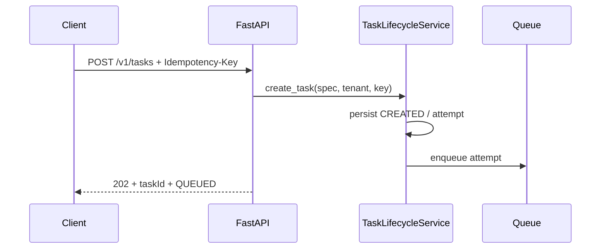
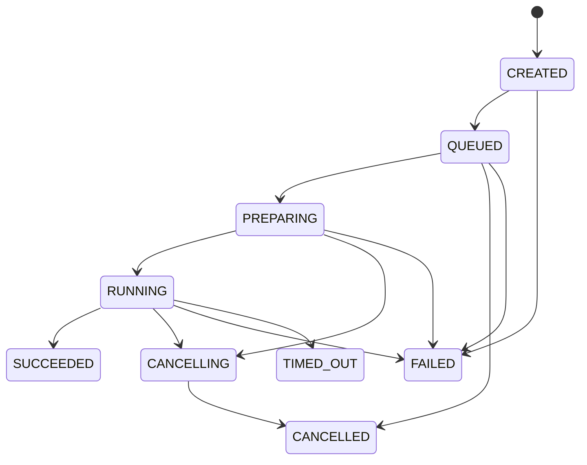
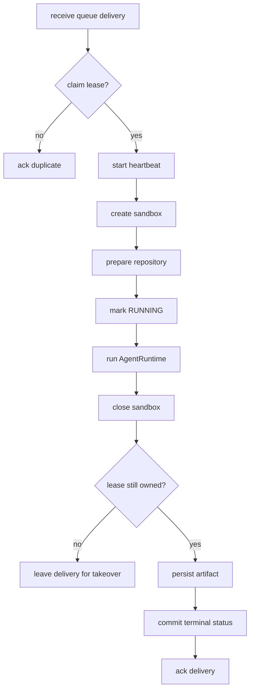

# 代码导览：从 HTTP 请求走到 Agent 产物

> 阅读目标：像使用代码解释器一样，先看入口与调用链，再深入每个模块的职责、关键类型和扩展点。

## 1. 推荐阅读路径

```text
src/main.py
  └─ src/platform.py
      ├─ src/api/*
      ├─ src/scheduler/*
      ├─ src/worker.py
      ├─ src/repository_preparation.py
      ├─ src/agent_runtime/*
      ├─ src/tools/*
      ├─ src/sandbox/*
      └─ src/storage.py
```

第一次阅读先按 1 → 4 → 6 → 7 的顺序，理解主链路；第二次再看状态机、错误和安全细节。

## 2. 应用入口：`src/main.py`

`create_app()` 是 HTTP 层的 composition root：

- 创建 FastAPI lifespan，并启动/停止后台 Worker；
- 挂载 Task 与 Discovery Router；
- 提供 `/healthz`、`/readyz`、首页、需求挖掘页和 Swagger；
- 将内部事件转换为 SSE；
- 列出并下载任务产物；
- 记录不含请求正文和密钥的结构化访问日志。

关键原则：API 只做验证、授权、查询和控制，不直接执行用户命令。



## 3. 依赖装配：`src/platform.py`

`create_platform()` 决定一个运行实例使用哪些 Adapter：

- `InMemoryTaskRepository`、`InMemoryTaskQueue`、`InMemoryLeaseManager`；
- `InMemoryEventStore` 与 `LocalArtifactStore`；
- `DemoProvider` 或 `OpenAIResponsesProvider`；
- `LocalSandboxProvider` 或 `DockerSandboxProvider`；
- `TaskLifecycleService`、`AgentRuntime`、`TaskWorker` 和 `DiscoveryService`。

这使业务代码依赖 `Protocol`，而不是依赖某个数据库、模型 SDK 或容器实现。生产化时可以逐个替换 Adapter，
无需重写 Agent Loop。

配置来自 `src/shared/settings.py`：先读取项目根 `.env`，再保留显式进程环境变量的优先级。敏感值不会被
`/readyz` 或 preflight 打印。

## 4. 任务控制面：`src/api` + `src/scheduler`

### API Schema 与 Router

`src/api/schemas.py` 使用严格 Pydantic 模型拒绝未知字段，负责将外部 JSON 转换为公共 `TaskSpec`。
`src/api/routes.py` 实现 Bearer 认证、幂等键校验、创建/查询/取消和安全错误响应。

### 生命周期服务

`TaskLifecycleService` 是任务领域核心：

- 创建 Task 与 Attempt；
- 计算请求指纹并实现幂等；
- 投递 QueueMessage；
- Worker 领取、进入 RUNNING、完成和取消；
- 校验状态转换和租约所有权；
- 为状态变化写入 attempt-scoped 事件。



`queue.py` 模拟 at-least-once 投递与可见性超时，`leases.py` 防止两个 Worker 同时提交，`cancellation.py`
提供跨层取消信号。这些实现是进程内 MVP，但语义与未来 Redis/PostgreSQL Adapter 对齐。

## 5. 仓库准备：`src/repository_preparation.py`

`LocalRepositoryPreparer` 支持两类来源：

- 允许根目录内的 `file://` 本地仓库；
- allowlist 主机上的公开 HTTPS Git 仓库。

它拒绝 URL 用户名/密码、非允许 scheme/host、越界本地路径和危险 ref，并使用 argv 方式调用 Git，避免 shell
拼接。仓库准备发生在受控阶段，凭证不会暴露给 Agent 命令。

## 6. 执行编排：`src/worker.py`

`TaskWorker.run_once()` 把多个独立模块连接成一个可靠纵向闭环：



Worker 统一映射 Runtime、Sandbox、Repository 与清理异常，保证失败不会被伪装成成功。租约心跳丢失后停止
提交；取消信号会穿过 Runtime 到正在执行的工具和进程树。

## 7. Agent Runtime：`src/agent_runtime`

`AgentRuntime.run()` 是有界的模型—工具循环：

1. 检查取消与总预算；
2. 调用 `LLMProvider.complete()`；
3. 记录模型使用量与公开事件；
4. 对每个 ToolCall 做重复/无进展检测；
5. 交给 Tool Registry 校验和执行；
6. 把工具结果作为 observation / `function_call_output` 加回上下文；
7. 接收 `submit_result`，或在终态/错误/预算耗尽时停止。

`budget.py` 追踪轮次、输入 token、输出 token 和墙钟时间。`events.py` 负责敏感文本脱敏和安全摘要。
`provider.py` 定义稳定的内部消息、工具调用、用量和响应类型。

### OpenAI Adapter

`openai_provider.py` 直接适配 Responses API：

- 将内部 tools 转换为 function tools；
- 映射 system/user/assistant 与 function call history；
- 解析多个 function calls、output text 和 token usage；
- 429、5xx 与网络异常映射为有限重试的临时错误；
- 其他 HTTP/格式错误不回显响应正文或 API Key；
- 使用 `store: false`，由本项目维护最小必要上下文重放。

## 8. 工具层：`src/tools`

`ToolRegistry` 持有名称、描述、JSON Schema、权限、超时、输出上限和 handler。执行顺序为：

```text
lookup → schema validation → policy authorization → timeout → execute → truncate → redact → event
```

内置工具：

- `list_files`：列出工作区文件；
- `read_file`：读取受限大小文本；
- `search_text`：搜索文件内容；
- `write_file`：受策略控制写入；
- `run_command`：argv-only，通过 SandboxSession 执行；
- `submit_result`：提交最终公开结果。

默认策略遵循最小权限；在 trusted local 模式中，命令执行能力默认不开放给模型。

## 9. 沙箱层：`src/sandbox`

### WorkspaceSession

统一暴露列文件、读写、搜索、运行命令、取消和关闭。`paths.py` 在每次访问前解析规范绝对路径，并检查路径
穿越和符号链接逃逸。

### Local Sandbox

只适合可信开发输入。Windows 使用 Job Object 控制进程树；命令有超时、参数长度、PID 和输出预算。

### Docker Sandbox

`build_create_argv()` 构造固定安全参数：非 root、只读 rootfs、network none、cap-drop ALL、
no-new-privileges、CPU/内存/PID/临时盘限制。Docker 控制命令与用户命令分离。

## 10. 事件与产物：`src/storage.py`

`InMemoryEventStore.append_next()` 在锁内原子分配 attempt sequence，避免 Runtime 与 Scheduler 并发写事件时冲突。
事件只记录公开摘要，不持久化模型私有思维链。

`LocalArtifactStore` 使用 SHA-256 和逻辑名称实现内容校验与幂等，限制单产物大小，并把真实存储路径隐藏在 API
响应之后。当前元数据在内存中，重启后不恢复；生产 Adapter 应使用 PostgreSQL + S3/MinIO。

## 11. FDE 客户需求发现：`src/discovery.py`

Discovery 是与仓库任务并列的产品模块，也是 FDE 进入客户后的前置工作台：

- `DiscoveryService` 管理会话、消息、状态和最终报告；
- `DemoDiscoveryAssistant` 提供可重复、无需费用的确定性 FDE 访谈流程；
- `ProviderDiscoveryAssistant` 使用同一 LLMProvider 按就绪门禁追问实施阻塞项；
- 报告严格区分事实、假设、决策、风险和开放问题，并形成研发与 QA 移交清单；
- `src/discovery_ui.py` 是无构建步骤的单页演示 UI；
- `src/api/discovery_routes.py` 提供创建、追加消息、完成和下载接口。

## 12. 测试怎么对应代码

```text
tests/api            HTTP、认证、幂等与错误契约
tests/scheduler      状态机、队列、租约、重复投递与取消
tests/agent_runtime  Provider、循环、预算、重试和工具调用
tests/tools          Schema、策略、权限和输出处理
tests/sandbox        路径、进程、Docker 参数与安全边界
tests/discovery      多轮需求会话与报告
tests/integration    跨模块生命周期和公开 API
tests/e2e            成功、取消、超时、策略拒绝和场景目录
tests/security       仓库来源、ref 与路径攻击
```

## 13. 最适合贡献的扩展点

- 为 `TaskRepository`、`TaskQueue`、`EventSink`、`ArtifactStore` 实现生产 Adapter；
- 增加真实任务列表、SSE 持续订阅和 React/Next.js 控制台；
- 增加 Provider 评测、成本路由和结构化输出；
- 增加私有仓库短期凭证 Broker，但保证凭证不进入 Agent 上下文；
- 将 Docker 隔离升级为 gVisor/Kata/Firecracker 并补充对抗测试；
- 在独立质量门之后实现多 Agent DAG，而不是在同一会话里模拟角色。
