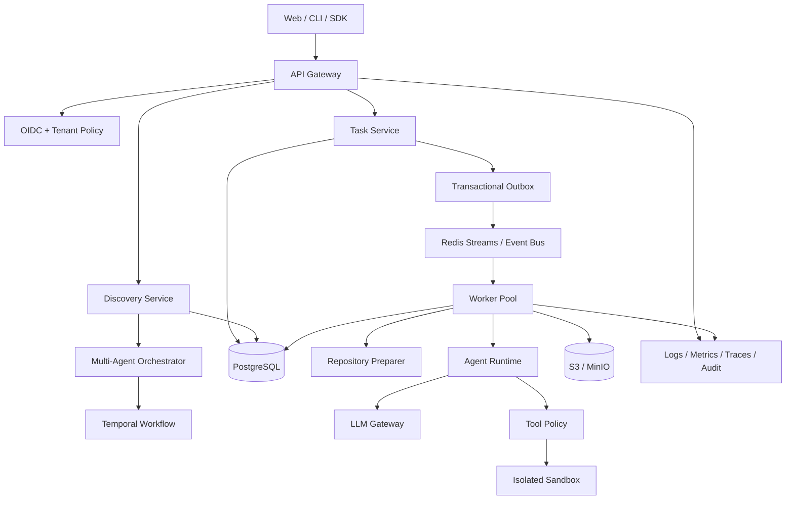

# 系统、数据与 API 设计

- 文档版本：1.0
- 状态：`DRAFT`
- 关联：[MVP 架构](../architecture.md)、[目标架构](../multi-agent-platform-architecture.md)

## 1. 架构原则

- 控制面保存可信状态，执行面处理不可信代码和模型工具调用。
- 业务状态、模型供应商、队列和沙箱均通过端口/适配器解耦。
- 消息至少一次，业务效果幂等；不依赖“恰好一次”幻想。
- 先用模块化单体保持一致性边界，再按负载和组织边界拆服务。
- 所有跨边界写入具有幂等键、版本、超时和审计。
- 失败、取消、超时和清理是一级流程，不是异常补丁。

## 2. 逻辑架构

## 3. 模块职责

- API Gateway：TLS、认证、限流、request ID、大小限制和路由。
- Discovery Service：会话、消息、RequirementSnapshot、问题和报告元数据。
- Task Service：任务、attempt、状态机、幂等、取消和查询投影。
- Orchestrator：需求分析 DAG、审批、重试、等待用户和质量门。
- Worker：租约、仓库准备、沙箱创建、Runtime、产物和最终清理。
- LLM Gateway：模型路由、供应商适配、重试、用量、脱敏和成本。
- Tool Policy：工具注册、Schema、RBAC/ABAC、路径、网络和预算策略。
- Sandbox Provider：工作区、资源隔离、进程树和生命周期销毁。
- Artifact Service：对象存储、哈希、扫描、保留和签名下载。
- Audit/Observability：不可变审计、结构化日志、指标和 trace。

## 4. 数据模型

生产数据库建议至少包含：

- `tenants(id, name, status, policy_version, created_at)`
- `users(id, subject, display_name, status)`
- `memberships(tenant_id, user_id, role)`
- `discovery_sessions(id, tenant_id, status, version, requirement, context, timestamps)`
- `discovery_messages(session_id, sequence, role, content_ref, created_at)`
- `requirement_snapshots(id, session_id, version, schema_version, body_json, quality_score)`
- `decisions(id, snapshot_id, key, value_json, status, approver, evidence_ref)`
- `tasks(id, tenant_id, idempotency_key, status, spec_json, version, timestamps)`
- `attempts(id, task_id, number, status, worker_id, lease_until, error_json, usage_json)`
- `events(attempt_id, sequence, type, payload_json, occurred_at)`
- `artifacts(id, tenant_id, owner_type, owner_id, logical_name, sha256, object_key, size, state)`
- `approvals(id, tenant_id, action, scope_json, status, requested_by, decided_by, expires_at)`
- `outbox(id, aggregate_type, aggregate_id, type, payload_json, published_at)`
- `audit_log(id, tenant_id, actor, action, resource, decision, request_id, occurred_at)`

关键约束：tenant 必须出现在所有可租户访问的索引前缀；`(tenant_id, idempotency_key)` 唯一；
`(attempt_id, sequence)` 唯一；`(task_id, attempt_number)` 唯一；逻辑产物使用
`(owner_id, logical_name, content_sha256)` 去重；所有状态更新使用 version 乐观锁。

## 5. 一致性和事务

创建任务在单个 PostgreSQL 事务中写入 task、attempt 和 outbox。发布器异步把 outbox 投递到队列；Worker 重复收到
消息时通过 attempt 状态和租约幂等返回。事件 sequence 由存储层原子分配。产物先上传临时对象，完成哈希和扫描后
提交元数据；任务终态只引用已经提交的产物。取消信号同时写数据库和发布消息，Worker 每个边界检查取消状态。

## 6. API 设计

当前冻结接口见 `docs/contracts/openapi.yaml`。生产扩展建议：

- `POST /v1/discovery/sessions`
- `POST /v1/discovery/sessions/{id}/messages`
- `GET /v1/discovery/sessions/{id}`
- `POST /v1/discovery/sessions/{id}/finalize`
- `GET /v1/discovery/sessions/{id}/snapshot`
- `POST /v1/tasks`
- `GET /v1/tasks/{id}`
- `POST /v1/tasks/{id}/cancel`
- `GET /v1/tasks/{id}/events`，支持 `afterSequence` 和 SSE。
- `GET /v1/tasks/{id}/artifacts`
- `GET /v1/artifacts/{id}/download`
- `POST /v1/approvals/{id}/decision`

写接口要求 `Idempotency-Key`；响应包含 `requestId`、资源版本和稳定错误码。列表使用不透明 cursor。错误响应不暴露
供应商正文、内部路径、凭证、跨租户资源是否存在或模型私有推理。

## 7. 事件设计

除现有任务事件外，目标系统增加：

- `discovery.snapshot_updated`
- `discovery.question_requested`
- `agent.run_started/completed/failed`
- `quality.gate_evaluated`
- `approval.requested/decided/expired`
- `sandbox.created/destroyed/cleanup_failed`
- `artifact.quarantined/released/expired`

事件信封统一包含 `eventId`、`tenantId`、`aggregateId`、`attemptId`、`sequence`、`type`、`schemaVersion`、
`occurredAt`、`correlationId` 和 payload。事件不是命令；消费者必须幂等并忽略未知可选字段。

## 8. 容量基线

Beta 假设 20 个租户、日均 2,000 个任务、峰值 50 并发、平均任务 5 分钟、每任务 100 个事件和 5MB 产物。
这意味着日增约 20 万事件和 10GB 原始产物。PostgreSQL 事件按月或租户分区；产物进入对象存储并设置生命周期；
Worker 数按并发和模型限额水平扩展。正式容量必须用生产流量模型重新计算，并分别压测 API、队列、数据库、对象存储
和沙箱启动。

## 9. 技术栈

- 当前：Python 3.10+、FastAPI、Pydantic、httpx、Uvicorn、pytest、Ruff、mypy。
- Next：Python 3.12、SQLAlchemy 2、Alembic、PostgreSQL 16、Redis 7、MinIO/S3、OpenTelemetry。
- 工作流：Temporal；较小部署可暂用 transactional outbox + Redis Streams。
- 前端：Next.js、React、TypeScript、TanStack Query、SSE、Playwright。
- 基础设施：Docker/Kubernetes、Helm、Terraform、Vault/KMS、Prometheus/Grafana/Loki/Tempo。

## 10. 关键 ADR

- ADR-001：MVP 采用模块化单体，生产持久化后再按负载拆分。
- ADR-002：队列至少一次，领域层保证幂等。
- ADR-003：Runtime 仅依赖 SandboxSession，不提供宿主执行逃生口。
- ADR-004：需求事实采用结构化快照，聊天文本只作为来源证据。
- ADR-005：生产默认 Docker + 加固运行时；高风险租户使用更强虚拟化隔离。
- ADR-006：报告生成与独立质量评审使用不同 Agent/模型上下文。

每项 ADR 在实施前应使用模板记录背景、备选方案、取舍、后果和回滚条件。
