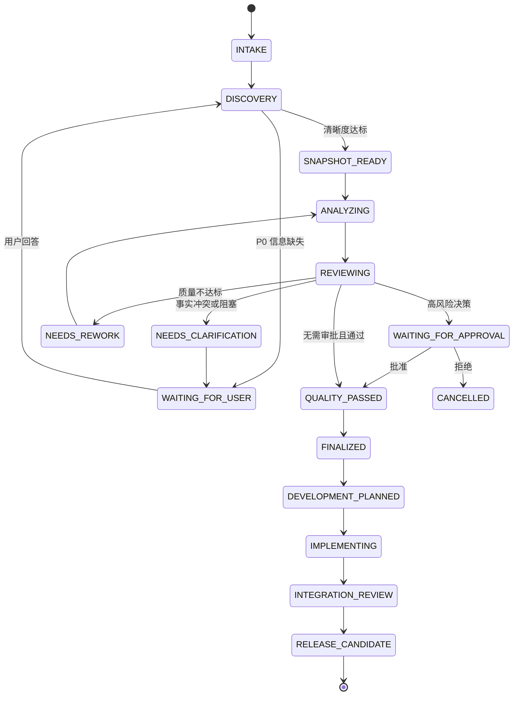
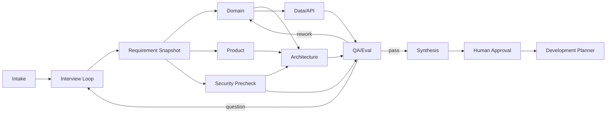

# 多 Agent 编排详细设计

- 文档版本：1.0
- 状态：`DRAFT`
- 原则：专业分工、结构化交接、有限并行、独立评审、人类批准

## 1. 设计目标

多 Agent 不是同时打开多个聊天窗口，而是把目标分解为具有明确输入、输出、所有权、预算、依赖和验收条件的
运行单元。Orchestrator 负责状态和决策，Agent 负责限定范围内的分析或实现，Shared Blackboard 保存版本化事实，
质量门决定是否继续、返工或请求用户。

## 2. 两阶段团队

### 2.1 需求与设计团队

- Intake Agent：分类领域、风险、清晰度和推荐流程。
- Interview Agent：选择下一轮高信息增益问题。
- Domain Agent：实体、规则、状态、异常、领域术语和专家确认项。
- Product Agent：目标、角色、MVP、优先级、指标和验收。
- Architect Agent：上下文、模块、交互、部署、扩展和 ADR。
- Data/API Agent：数据模型、事务、幂等、OpenAPI 和事件。
- Security Agent：数据分类、威胁、权限、审批和残余风险。
- QA/Eval Agent：需求覆盖、矛盾、可测试性、质量评分和返工建议。
- Synthesis Agent：合并经过评审的结构化产物并生成报告。

### 2.2 开发与交付团队

- Tech Lead Agent：公共骨架、契约、任务 DAG、集成和最终验收。
- Backend Agent：领域、API、持久化、队列和调度。
- Frontend Agent：交互、可访问性、状态同步和端到端测试。
- Runtime Agent：模型循环、上下文、预算、工具协议和事件。
- Sandbox/Security Agent：隔离、命令、路径、网络和攻击测试。
- QA Agent：契约、集成、E2E、回归和质量报告。
- Integration Agent：合并、迁移、打包和发布候选。

## 3. 编排状态机

`FINALIZED` 只表示设计产物冻结；不能等同于已经开发、已经测试或已经上线。

## 4. Shared Blackboard 契约

每个字段必须携带 `value`、`status`、`sourceRefs`、`ownerAgent`、`confidence`、`updatedAt` 和 `version`。
核心分区为：

- `confirmedFacts`：用户或权威系统确认的事实。
- `assumptions`：为了推进而采用的默认值，必须带失效条件。
- `conflicts`：两个来源的冲突描述及待决策人。
- `openQuestions`：优先级、阻塞级别、负责人和截止时间。
- `actors/workflows/rules/entities/integrations/nonFunctional`：结构化需求主体。
- `decisions`：备选方案、决策、批准人和 ADR。
- `artifacts`：类型、版本、哈希、生产 Agent 和验证状态。
- `qualityResults`：规则分、评审分、证据、缺陷和门禁结论。

Agent 不得直接覆盖另一个 Agent 的确认事实。发生冲突时追加 proposal，由 Orchestrator 或人类决策。

## 5. 任务 DAG

只有没有共享写入冲突、输入已经冻结且失败可以独立重试的节点才能并行。访谈、公共契约、最终集成和发布判断
保持串行。

## 6. Agent Run 输入输出

输入统一包含：`runId`、`role`、`objective`、`inputArtifactRefs`、`allowedTools`、`writeScope`、`modelPolicy`、
`budget`、`deadline`、`acceptanceChecks` 和 `correlationId`。输出统一包含：`status`、`summary`、
`artifactRefs`、`proposedChanges`、`evidence`、`qualitySignals`、`openIssues`、`usage` 和 `errors`。

自由文本只用于人类阅读；下游消费必须依赖经 JSON Schema 验证的结构化输出。输出 Schema 版本不兼容时，任务失败
或进入迁移节点，不允许悄悄丢字段。

## 7. 模型路由与上下文

- 分类、提取和格式校验优先选择低成本模型。
- 架构、安全和综合使用高推理能力模型，并设置更严格预算。
- 生成者与 Reviewer 使用独立上下文，必要时使用不同模型降低共同偏差。
- 上下文只包含完成任务所需的最小资料；凭证、其他租户数据和完整日志禁止进入。
- 长会话使用摘要和结构化快照；不得依赖无限聊天历史。
- 每个 Prompt 具有名称、版本、输入 Schema、输出 Schema、模型策略和回归评测集。

## 8. 重试、超时与幂等

- 供应商 429、5xx 和网络中断可指数退避并抖动，遵守总 deadline。
- Schema 无效可使用一次格式修复；事实矛盾不得靠重复请求解决。
- 工具副作用必须携带 operation id；未知结果先查询再决定是否重试。
- Agent Run 以 `(workflowId, nodeId, inputVersion)` 幂等。
- 重试不能扩大工具权限、预算、网络和写入范围。

## 9. 质量门

确定性门检查 Schema、必填字段、来源、P0 问题、契约语法、敏感信息和预算。LLM Reviewer 检查领域深度、矛盾、
方案取舍、安全和可测试性。人工门处理范围、合规、费用、外部写入和生产发布。推荐质量阈值：结构覆盖 ≥ 90%，
P0 追踪率 100%，未确认事实冒充确认事实为 0，Critical/High 安全缺陷为 0，领域专家抽检通过率 ≥ 85%。

## 10. 可观测性和评测

每个节点记录排队、运行、模型、工具、重试、token、成本、质量分和返工原因。离线评测包含固定输入和黄金快照；
在线评测抽样比较事实一致性、任务完成率、人工接管率和用户修改率。任何 Prompt/模型升级必须在代表性评测集上
对质量、延迟、成本和安全回归后灰度发布。
