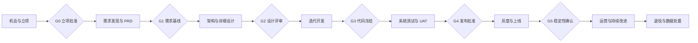

# Cloud Agent Platform 软件开发生命周期文档中心

## 1. 文档目的

本目录把 Cloud Agent Platform 从面试型 MVP 扩展为可按真实企业流程推进的产品基线。文档覆盖立项、需求、
设计、开发、测试、发布、运维和退役，并明确区分：

- `As-Is`：仓库中已经实现并通过测试的能力。
- `Next`：下一阶段内部试用版本应完成的能力。
- `Target`：生产级、多租户、可审计平台的目标设计，不代表已经实现。

当本文档与可运行代码不一致时，以自动化测试、OpenAPI 契约和代码行为作为当前事实，以本目录作为变更目标。

## 2. 生命周期和阶段门禁

门禁要求：

- G0：商业目标、目标用户、预算负责人和项目负责人明确。
- G1：P0 范围、非目标、关键流程、NFR、验收标准和未决问题明确。
- G2：API、数据、状态机、安全边界、容量估算和 ADR 通过评审。
- G3：功能完成，Critical/High 缺陷为零，迁移和回滚脚本就绪。
- G4：测试、性能、安全、UAT、运维和变更审批全部通过。
- G5：灰度指标稳定，告警、备份、恢复和成本数据正常。

## 3. 文档导航

1. [产品与业务需求](./01-product-and-business-requirements.md)
2. [软件需求规格说明书](./02-software-requirements-specification.md)
3. [系统、数据与接口设计](./03-system-data-api-design.md)
4. [多 Agent 编排设计](./04-multi-agent-orchestration-design.md)
5. [开发计划与工程规范](./05-development-plan.md)
6. [测试与质量计划](./06-test-and-quality-plan.md)
7. [安全、隐私与合规](./07-security-privacy-compliance.md)
8. [发布、部署与回滚](./08-release-deployment-runbook.md)
9. [运维、SRE 与灾备](./09-operations-sre.md)
10. [项目治理、风险与变更](./10-project-governance-and-risk.md)
11. [验收、移交与追踪矩阵](./11-acceptance-handover-traceability.md)

已有专项文档继续有效：

- [GitHub 项目首页与快速开始](../../README.md)
- [产品定位与开发需求](../product-positioning.md)
- [代码导览](../code-tour.md)
- [系统架构图解](../system-architecture.md)
- [现有需求基线](../requirements.md)
- [MVP 架构](../architecture.md)
- [目标多 Agent 架构](../multi-agent-platform-architecture.md)
- [安全边界](../security-boundary.md)
- [OpenAPI 契约](../contracts/openapi.yaml)
- [事件契约](../contracts/agent-events.md)
- [多场景需求发现评测](../reviews/discovery-scenario-evaluation.md)

## 4. 角色与责任

- Sponsor：确认商业价值、预算、风险容忍度和最终上线决策。
- Product Owner：维护范围、优先级、验收标准和业务决策。
- Tech Lead：维护架构、公共契约、任务 DAG、集成和技术验收。
- Backend/Frontend/Runtime/Sandbox Engineer：实现授权模块并提供测试证据。
- QA：维护测试策略、需求覆盖和发布质量报告。
- Security：威胁建模、安全评审、例外审批和事件响应。
- SRE：SLO、容量、监控、发布、灾备和生产值守。
- Data/Privacy Owner：数据分类、保留、删除和合规批准。

一项活动只能有一个最终负责人。Agent 可以产出分析和实现，但业务批准、合规例外、生产发布和高风险外部写入
必须由人类负责人确认。

## 5. 文档治理

每份基线文档应包含版本、状态、负责人和评审日期。状态只使用：

- `DRAFT`：正在编写，不可作为开发承诺。
- `IN_REVIEW`：等待业务、技术或安全评审。
- `BASELINED`：已批准，变更必须走变更控制。
- `SUPERSEDED`：已被新版本替代，仅用于审计。

需求、API、数据和安全边界发生变化时，必须同步更新需求 ID、测试 ID、ADR、迁移方案和发布说明。所有 P0
需求都必须能追踪到设计、代码模块、测试和验收证据。

## 6. 当前成熟度

当前属于 `MVP / 技术验证完成`：已有 FastAPI API、需求发现页面、任务状态机、Worker、可替换 LLM Provider、
工具注册表、Docker/本地 Sandbox、事件、产物和自动化测试。尚未达到生产级的关键原因包括进程内存储、
单实例队列、Demo 需求报告器、缺少企业 SSO/RBAC、缺少生产对象存储和签名 URL、Docker 隔离尚未经过真实
恶意工作负载验证，以及缺少持续交付、SLO 和灾备演练。
