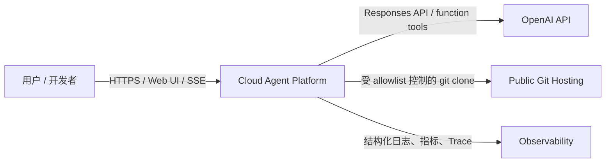
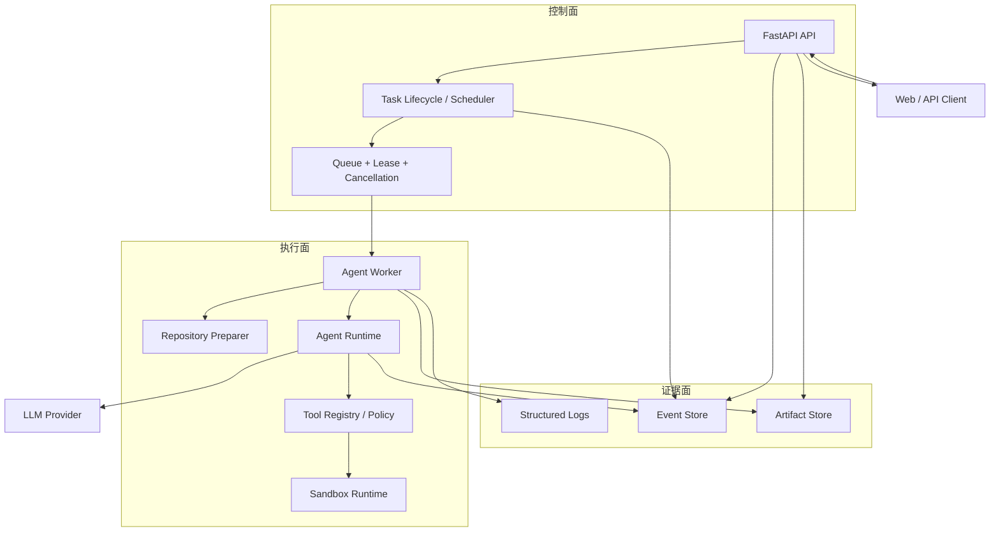
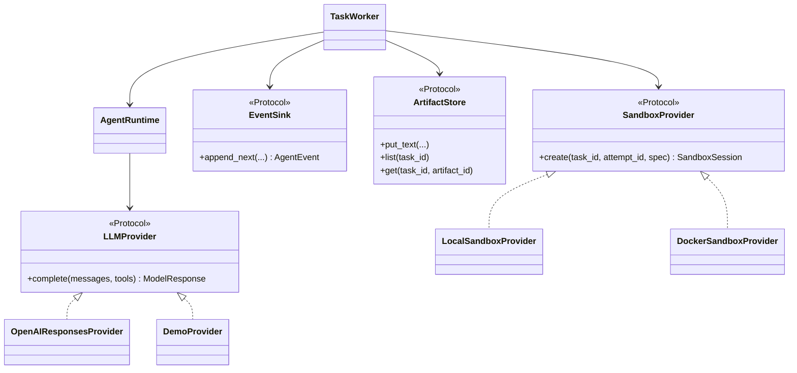
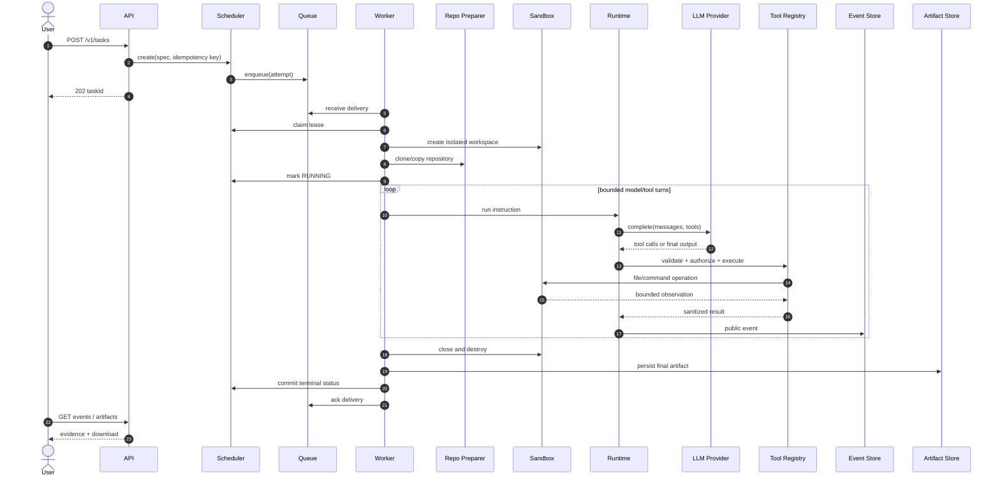
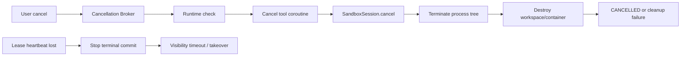
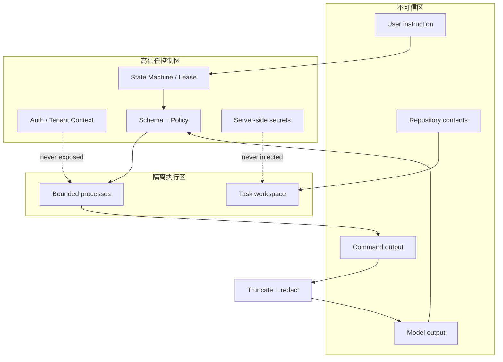
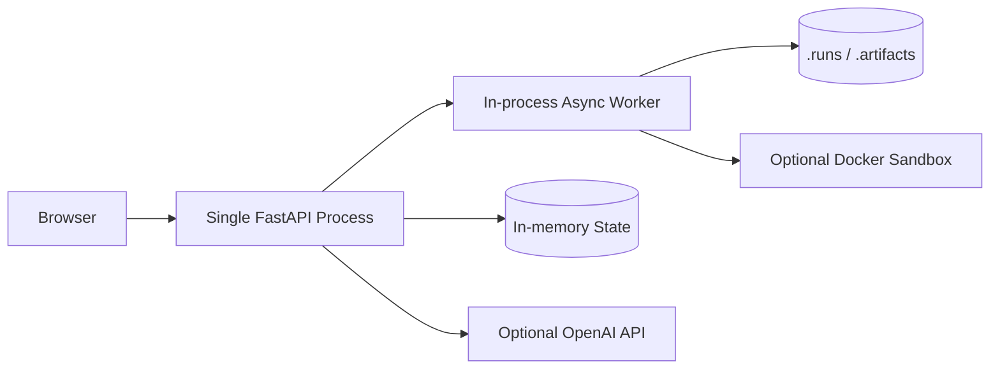
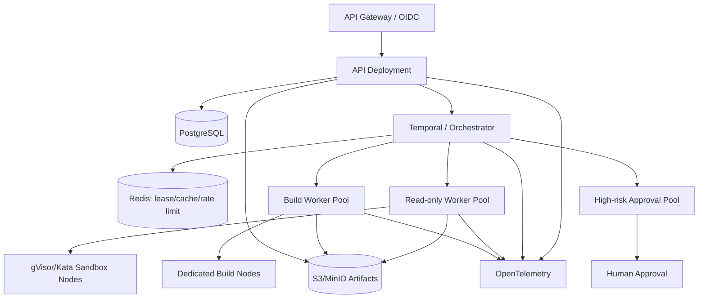

# 系统架构设计

## 1. 架构目标

Cloud Agent Platform 的首要目标不是“让模型拥有最多权限”，而是让一个不确定的模型在确定性的系统边界里完成工作。
架构围绕六个属性设计：有界、可取消、可审计、可替换、可恢复、默认安全。

## 2. 系统上下文

## 3. 容器视图

### 控制面

决定“谁可以创建什么任务、任务现在处于什么状态、谁拥有执行权、何时取消”。它不执行模型给出的命令。

### 执行面

处理仓库、模型上下文、工具、沙箱和预算。它假设用户输入、仓库内容、模型输出和命令输出都不可信。

### 证据面

保存可以公开给用户的状态、行动摘要、工具结果元数据、用量和最终产物，不保存私有思维链。

## 4. 组件与端口/适配器

端口/适配器带来三个直接收益：离线测试无需真实模型费用；业务语义不绑定 Docker 或 OpenAI SDK；生产化可以逐步
替换基础设施，而不必一次性拆成微服务。

## 5. 任务主时序

## 6. 取消和故障传播

取消不是一个数据库字段：它必须跨过 Worker、Runtime、工具和操作系统进程边界。清理失败会覆盖成功结果并进入显式
失败，避免把残留进程留在宿主机。

## 7. 信任边界与数据流

关键控制：

- 用户、仓库和模型都不能直接控制宿主 shell；
- 工具参数先做 JSON Schema 与权限校验；
- 文件真实路径必须留在 attempt workspace；
- 命令使用 argv，限时、限 PID、限输出，可取消；
- OpenAI/Git/平台凭证留在服务器高信任区；
- 事件与日志在写出前脱敏，不记录模型私有思维链。

## 8. 当前部署

这是为了在较短开发周期内保持纵向闭环。它的限制是：服务重启丢失任务元数据，多实例不能共享队列或租约，本地产物
没有远程对象存储的生命周期和签名 URL。

## 9. 生产演进架构

演进原则：

1. 先替换持久化 Adapter，再水平扩展 Worker；
2. 先完成租户、配额、成本和审批，再开放高风险工具；
3. 按工作负载风险分池，不让浏览器、构建和只读分析共享同一策略；
4. 多 Agent 只用于可以清晰拆分的 DAG 节点，最终综合与质量门保持显式；
5. 通过代表性 Eval 比较成功率、成本和延迟，不以 Agent 数量作为质量指标。

## 10. 核心架构取舍

- **模块化单体优先**：MVP 先稳定契约、状态和边界，避免过早微服务化。
- **at-least-once + 幂等**：现实队列更容易提供至少一次，业务层负责防重复。
- **Protocol 而非厂商 SDK 扩散**：模型、存储、队列和沙箱都通过内部类型隔离。
- **公开事件而非思维链**：提供可审计证据，同时不保存或暴露私有推理。
- **默认拒绝**：网络、命令、路径和秘密都按最小权限开放。
- **真实限制写进文档**：Docker 和内存 Adapter 的边界公开说明，避免把演示架构误当生产承诺。

更完整的数据、API、多 Agent、SRE 和发布设计见 [SDLC 文档中心](sdlc/README.md)。
